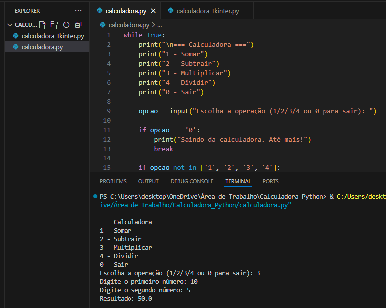

# 🧮 Calculadora em Python

Este projeto apresenta duas versões de uma calculadora desenvolvida em Python:

- 🖥️ **Versão Terminal** (Python puro)
- 🪟 **Versão com Interface Gráfica** (Tkinter)

---

## ✨ Funcionalidades

- Soma, subtração, multiplicação e divisão
- Tratamento de opções inválidas (terminal)
- Cálculo de expressões matemáticas simples (GUI)

---

## 📸 Imagens do Projeto

### Terminal (Python puro)


### Interface Gráfica (Tkinter)


---

## ⚙️ Tecnologias Utilizadas

<p align="left">
  
  
</p>

---

## ▶️ Como Executar

### Terminal
```bash
python calculadora.py

### Interface Gráfica
python calculadora_tkinter.py

👩‍💻 Autora
Desenvolvido com dedicação por Yasmim Freitas


