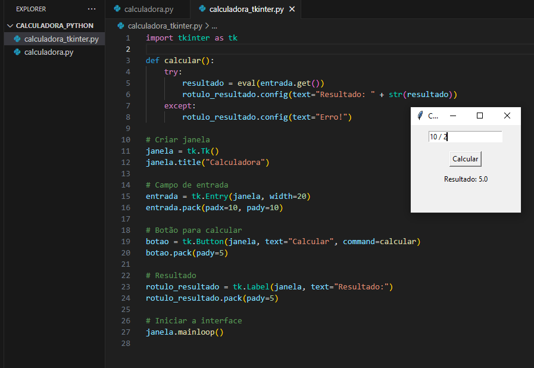

# 🧮 Calculadora em Python

Este projeto apresenta duas versões de uma calculadora desenvolvida em Python:

- 🖥️ **Versão Terminal** (Python puro)
- 🪟 **Versão com Interface Gráfica** (Tkinter)

---

## ✨ Funcionalidades

- Soma, subtração, multiplicação e divisão
- Tratamento de opções inválidas (terminal)
- Cálculo de expressões matemáticas simples (GUI)

---

## 📸 Imagens do Projeto

### Terminal (Python puro)

### Interface Gráfica (Tkinter)

---

## ⚙️ Tecnologias Utilizadas

  
  🪟 Tkinter (interface gráfica nativa do Python)

---

## 👩‍💻 Autora

Desenvolvido com dedicação por [Yasmim Freitas](https://github.com/YasmimFreitas13)

